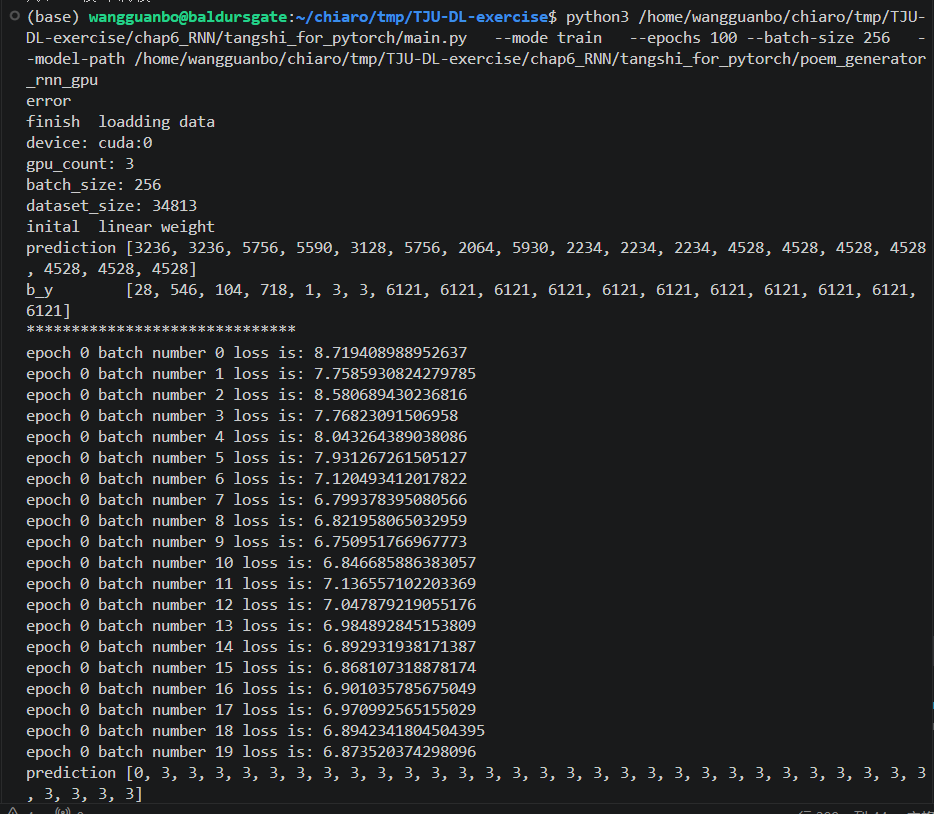
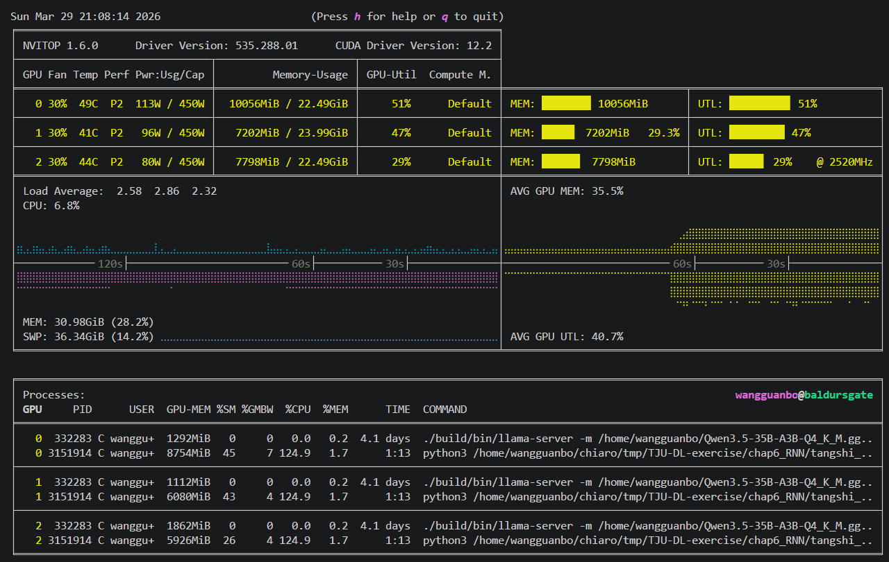
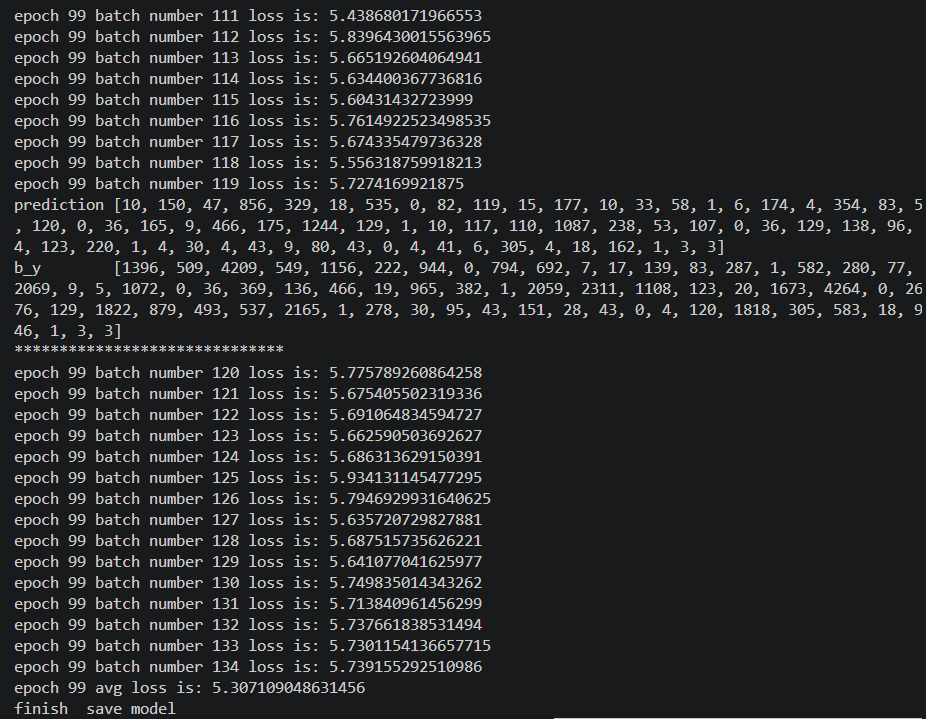
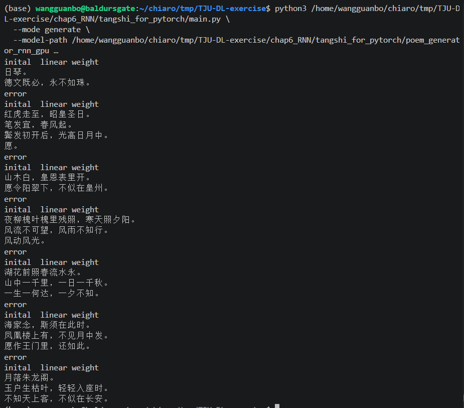

# 第六章作业报告：基于循环神经网络的唐诗生成

## 一、实验任务

本实验旨在利用循环神经网络（RNN）完成自回归式的唐诗生成任务。实验要求在给定代码框架的基础上补全核心逻辑，并利用指定的首字（“日、红、山、夜、湖、海、月”）生成完整的诗句。本实验基于 PyTorch 深度学习框架实现，所有训练与推理过程均在 `chap6_RNN/tangshi_for_pytorch` 目录下完成。

## 二、相关模型原理

序列生成任务的核心在于对上下文时序依赖的建模。相较于传统的前馈神经网络，循环神经网络通过引入 Hidden State，使得网络能够保留历史时间步的信息，从而有效捕捉文本中字与字之间的时序逻辑关联。

- **基础 RNN**：其思想直观，通过时间步的展开处理序列数据。然而在面对长序列时，基础 RNN 极易受梯度消失与梯度爆炸问题的困扰，导致模型对长距离依赖的建模能力较弱。
- **LSTM**：为解决基础 RNN 的缺陷，LSTM 引入了 Cell State 以及三个门控机制（遗忘门、输入门、输出门）。这种架构赋予了模型选择性记忆与遗忘历史信息的能力。在诗歌生成任务中，LSTM 能够更稳定地捕捉长距离的字词搭配与语义连贯性。
- **GRU**：作为 LSTM 的变体，GRU 将门控精简为更新门与重置门，在保留长序列建模能力的同时，减少了网络参数，提升了运算效率。通常情况下，GRU 在性能与计算资源消耗之间取得了较好的平衡。

综合考量文本生成任务的复杂性与模型表现，本实验最终选用双层 LSTM 作为核心架构进行唐诗生成，以期获得更优的生成质量与训练稳定性。

## 三、实验过程与实现思路

#### 1. 数据预处理

实验基于给定的 `poems.txt` 数据集。数据清洗阶段，程序按“标题:内容”格式解析文本，剔除异常符号及长度越界的无效样本，并在每首诗首尾分别添加 `<START>` 与 `<END>` 标识符。随后，基于字符频率构建词表映射，将离散文本向量化。经过滤，最终参与训练的语料包含 34813 首唐诗，词表大小为 6122。

#### 2. 网络架构与训练策略

模型主体由 Embedding 层、双层 LSTM 层及全连接线性层构成。输入字符首先被映射为连续稠密向量，随后进入 LSTM 提取时序特征，最终由线性层结合 LogSoftmax 函数输出词表空间上的概率分布。训练采用典型的 Teacher Forcing 监督学习范式，目标序列为输入序列整体左移一位，以此优化 NLLLoss 损失函数，优化器选取 RMSprop。

#### 3. 计算性能优化

值得重点说明的是，原始代码库中的 `main.py` 偏向单样本 CPU 串行演算，训练耗时极长，我本机两小时才训练俩 epoch，因此**本实验对训练框架进行了工程重构**。通过适配多 GPU 并行训练逻辑，程序成功在服务器上 3 张 RTX 4090 显卡上运行。这一优化大幅提升了张量运算效率，使得模型能够在合理时间内完成 100 个 Epoch 的深度迭代。

最终训练超参数：`batch_size = 256`, `epoch = 100`, `embedding_dim = 100`, `hidden_dim = 128`, `num_layers = 2`。

#### 4. 生成策略

推理阶段采用自回归生成。给定人为设定的初始字符（如“月”），模型预测下一个概率最大的字符，并将其拼接到当前序列中，循环迭代，直至触发结束标记或达到最大序列长度。

## 四、实验结果

本次实验使用训练好的模型对题目要求的七个开头词进行了生成，分别是“日、红、山、夜、湖、海、月”。256 batch、100 epoch 训练后生成结果如下。

> 日：日琴。德文既必，永不如珠。  
> 红：红虎走至，昭皇圣日。笔发宜，春风起。鬓发初开后，光高日月中。愿。  
> 山：山木白，皇恩表里开。愿令阳翠下，不似在皇州。  
> 夜：夜柳槐叶槐里残照，寒天照夕阳。风流不可望，风雨不知行。风动风光。  
> 湖：湖花前照春流水永。山中一千里，一日一千秋。一生一何达，一夕不知。  
> 海：海家念，斯须在此时。凤凰楼上有，不见月中发。愿作王门里，还如此。  
> 月：月落朱龙阁。玉户生枯叶，轻轻入座时。不知天上客，不似在长安。

实验截图：

在3张4090服务器上启动训练（因为是通过学长账号登录的ssh服务器因此服务器 user ID 不是我的名字）

训练时GPU情况：

训练结束：

生成效果：

## 五、结果分析

对上述生成文本进行定性分析，可得出以下结论：

1. **特征学习有效性**：模型成功捕捉到了古典诗歌的典型意象与高频词组（如“春风”、“日月”、“残照”、“夕阳”、“长安”等）。部分句式（如“山木白，皇恩表里开”、“月落朱龙阁。玉户生枯叶”）在局部呈现出了较好的韵律感与古文气息，验证了 LSTM 在特征提取上的有效性。
2. **现存局限性**：由于本实验采用字符级建模与简单的贪心解码策略，模型在全局语义一致性上仍有欠缺。生成的诗句在句间逻辑上偶显松散，且局部存在意象堆砌与生硬收尾（如“夜柳槐叶槐里残照”或突兀的结尾“愿”）。这受限于当前模型的浅层网络结构及较小的隐状态维度，使得长距离语义约束能力依然不足。

总体而言，作为课程验证性实验，当前模型已远超随机输出水平，初步具备了风格化文本的生成能力，达成了利用 RNN 探索唐诗生成的实验初衷。

此外我还尝试过 1000 epoch、256 batch 的长时间训练，但是观察发现其实在大概 50 epoch 以后模型 loss 基本就稳定在了 4.6-5.6 之间，loss不会下降，因此最终还是采用的 100 epoch 结果。
